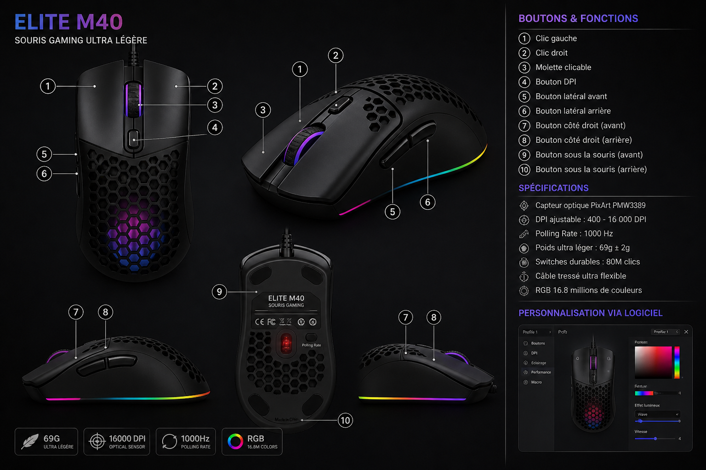

# Game_XClicker_Elite

<p align="center">
  
</p>

<h1 align="center">Game XClicker Elite — iCUE Edition</h1>

<p align="center">
  Macro souris / clavier Win32 · Interface web style Corsair iCUE · 6 macros sidebar<br>
  Windows · Python 3.12 · Node.js optionnel (<code>C:\src\node.exe</code>)
</p>

---

# Réinstallation PyCharm (propre)

## 1. Supprimer l'ancien projet

Dans PyCharm : **File → Close Project**

Supprimez le dossier local (exemple) :

```text
C:\Users\wargriff\visual_studio_project\Game_XClicker_Elite
```

## 2. Réinstaller depuis GitHub

**Option A — script automatique (recommandé)**

Double-cliquez `CLONE_FRESH.bat` (télécharge depuis GitHub puis lance `REPARER.bat`).

**Option B — manuel**

```cmd
cd /d "C:\Users\wargriff\visual_studio_project"
git clone https://github.com/wargriff/Game_XClicker_Elite.git
cd Game_XClicker_Elite
REPARER.bat
```

## 3. Ouvrir dans PyCharm

1. **File → Open** → dossier `Game_XClicker_Elite`
2. Interpréteur : Python 3.12 (venv parent `..\.venv` ou créez `.venv`)
3. **Run → Edit Configurations → Import** → `pycharm/Game_XClicker_Elite.run.xml`
4. Script : **`OUVRE_MOI.py`** — cliquez Run ▶

## 4. Lancement quotidien

- **C++** : `BUILD_CPP.bat` puis double-clic **`GameXClicker.exe`**
- **Python** : double-clic **`OUVRE_MOI.pyw`**

---

# Aperçu

Application desktop Windows :

* moteur macro Win32 (clics souris, touches clavier)
* interface web iCUE (`ui-web/`) dans une fenêtre native ou le navigateur
* API Sidecar Python port **17840**
* serveur Node.js port **5173** (optionnel, proxy UI)
* 6 macros configurables dans la sidebar
* profils JSON

```
GameXClicker.exe / OUVRE_MOI.pyw → Control Panel → native / web / build
```

---

# Interface

## Vue principale

<p align="center">
  
</p>

---

## Icône de l'application

<p align="center">
  
</p>

---

## Preview Gaming

<p align="center">
  
</p>

---

# Fonctionnalités

## Mouse Macro

* Auto-click gauche/droite
* CPS personnalisable
* délai personnalisable
* activation indépendante par bouton
* gestion temps réel

---

## Keyboard Macro

* support multi-touch
* simulation Win32 native
* dispatch séparé clavier/souris

---

## UI Sanctuary Edition (PyQt6)

* interface pro style Corsair iCUE
* thème Diablo 4 (or, sang, fond gothique)
* grille de tuiles devices / macros
* sidebar profils + navigation
* capteurs CPU / RAM / CPS en temps réel
* API Sidecar REST locale (port 17840)
* onglets HOME, DASHBOARD, DEVICES, MACROS, SETTINGS

---

## Profils

* sauvegarde JSON
* chargement automatique
* profils multiples

---

## Mode Game Safe

Réduit certains comportements agressifs pour améliorer la stabilité dans les jeux.

---

## RGB Engine

Système RGB intégré pour effets visuels et feedback utilisateur.

---

# Technologies utilisées

* Python 3.12+
* PyQt6
* Win32 API
* JSON
* Threading Python

---

# Structure du projet

```text
Game_XClicker_Elite/
│
├── assets/
│   ├── bg/diablo_bg.svg
│   ├── favicon/
│   ├── icons/
│   └── mouse.svg
│
├── core/
│   ├── engine.py
│   ├── models.py
│   └── win32_input.py
│
├── services/
│   ├── engine_proxy.py
│   ├── profile_manager.py
│   └── sidecar_api.py
│
├── ui/
│   ├── sanctuary_window.py
│   ├── pages/
│   ├── widgets/
│   └── styles/diablo_theme.py
│
├── profiles/
│   └── default.json
│
├── tests/
│   └── test_ui.py
│
├── main.py
├── gxclicker.py
├── START.bat
├── build.spec
├── requirements.txt
└── README.md
```

---

# Installation

## Windows — installation automatique

```cmd
git clone https://github.com/wargriff/Game_XClicker_Elite.git
cd Game_XClicker_Elite
REPARER.bat
```

`REPARER.bat` installe les dépendances Python, Node.js (`C:\src`), vérifie les fichiers et lance l'app.

## Manuel

```cmd
python -m venv .venv
.venv\Scripts\activate
pip install -r requirements.txt
cd nodejs && npm install && cd ..
python main.py
```

Vérification : `python CHECK_VERSION.py` → doit afficher **PRET**.

---

# Lancement

| Méthode | Commande |
|---------|----------|
| Windows (recommandé) | Double-clic **`START.bat`** |
| PyCharm | Run **`main.py`** |
| Navigateur seul | `START.bat browser` |
| Build .exe | `START.bat build` |

Au démarrage :

1. Moteur Win32 + profils
2. API Sidecar → `http://127.0.0.1:17840`
3. Node.js (si installé) → `http://127.0.0.1:5173`
4. Fenêtre iCUE (pywebview) ou fallback navigateur

Node.js : `C:\src\node.exe`, `Program Files\nodejs`, ou `PATH`.  
Variable : `XCLICKER_NODE_PATH=C:\src\node.exe`

---

## PyCharm

1. Script : **`main.py`**
2. Working directory : racine du projet
3. Import config : `pycharm/Game_XClicker_Elite.run.xml`
4. Ou double-clic **`PYCHARM_SETUP.bat`**

Ne pas utiliser : `run.py`, `Xmacro_main.py` (legacy).

---

# Lancement (développement)

```cmd
pip install -r requirements.txt
cd nodejs && npm install && cd ..
python main.py
```

---

## Mission Control Web

- **Node.js (prioritaire)** : `http://127.0.0.1:5173` — dashboard + proxy `/api` → Python
- **Sidecar Python (fallback)** : `http://127.0.0.1:17840/mission`

Clic sur tuile **Mission Control**, **Node.js** ou **Sidecar API** dans l'UI.

---

# Configuration

Les profils sont stockés dans :

```text
profiles/default.json
```

Vous pouvez :

* modifier les CPS
* changer les délais
* personnaliser les touches

---

# Compilation EXE

Sur **Windows** uniquement (API Win32).

## Installer PyInstaller

```bash
pip install pyinstaller
```

## Build (recommandé)

```cmd
START.bat build
```

Le build sera généré dans :

```text
dist/Game XClicker Elite/Game XClicker Elite.exe
```

---

# Tests

```bash
pip install -r requirements.txt
pytest tests/ -v
```

Sur Windows (avec écran), tous les tests UI s'exécutent. Sur Linux CI, les tests moteur/API passent ; les tests PyQt6 sont ignorés si l'affichage n'est pas disponible.

Tests couverts :
- Moteur macro + proxy
- Profils JSON
- API Sidecar
- Onglets header (HOME, DASHBOARD, DEVICES, **MACROS**, SETTINGS)
- Sidebar (PERFORMANCE, MACRO 1/2, etc.)
- Boutons burst sans récursion
- Attributs `master_combo` / `name_edit`

---

# Roadmap

* [ ] support multi-profils avancé
* [ ] overlay in-game
* [ ] hotkeys configurables
* [ ] thèmes UI
* [ ] statistiques avancées
* [ ] plugin system

---

# Sécurité

Ce projet est fourni à des fins éducatives et expérimentales.

L'utilisation de macros dans certains jeux peut enfreindre leurs conditions d'utilisation.

Utilisez ce logiciel sous votre propre responsabilité.

---

# Licence

MIT License

---

# Auteur

## Wargriff

GitHub :
https://github.com/wargriff

---

# Contributions

Les pull requests et suggestions sont les bienvenues.

## Fork

```bash
git fork
```

## Branch

```bash
git checkout -b feature/awesome-feature
```

## Commit

```bash
git commit -m "Add awesome feature"
```

## Push

```bash
git push origin feature/awesome-feature
```
